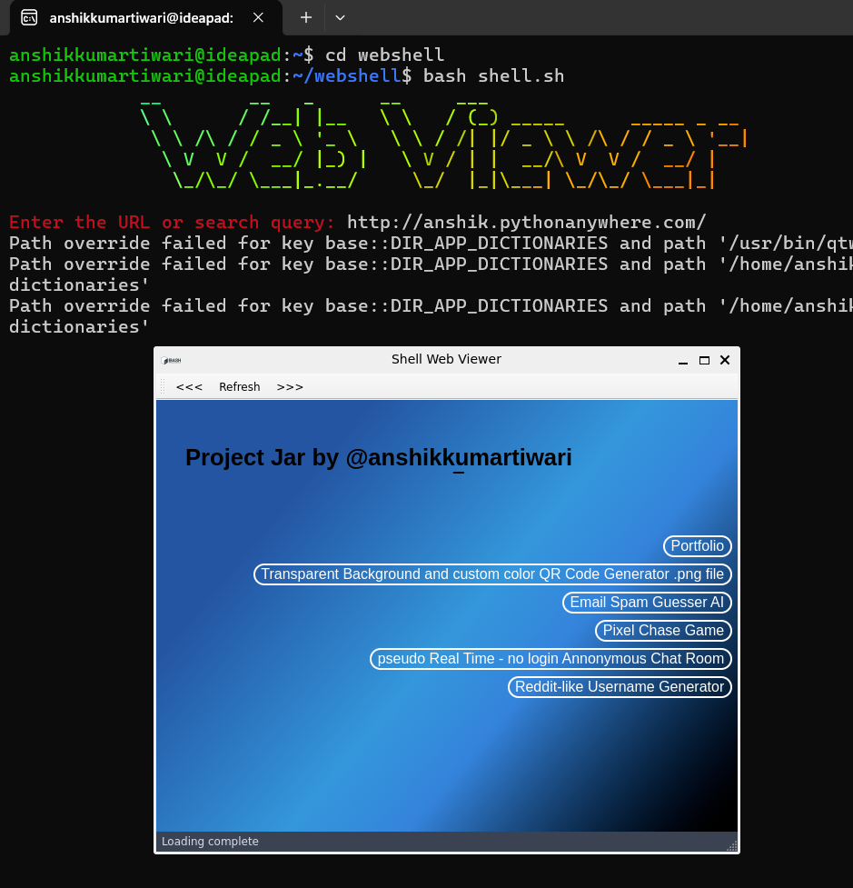
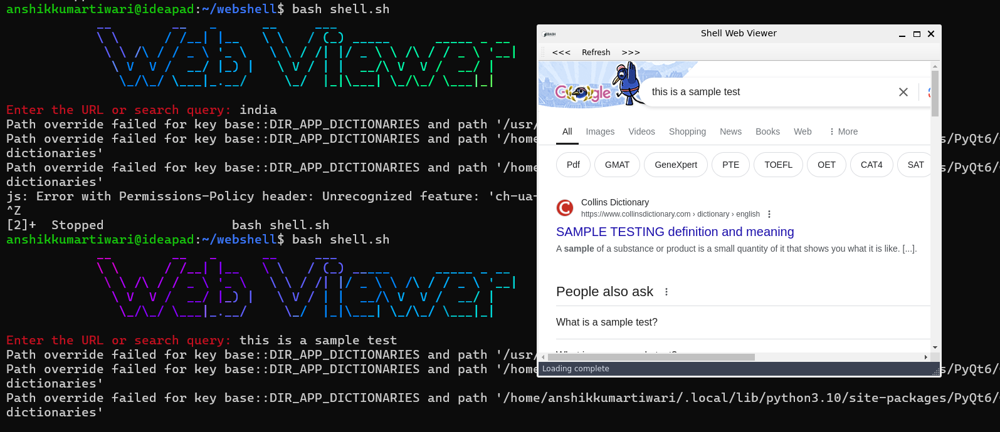

# Shell Web Viewer

Welcome to the **Shell Web Viewer**! This project combines the power of shell scripting and Python to create a simple yet powerful web browser interface. Whether you're entering a URL directly or searching the web, this tool has got you covered.

## Introduction

Ever wanted to browse the web straight from your terminal? Look no further! The Shell Web Viewer is a nifty tool that lets you do just that. With a sleek interface and seamless integration, it transforms your terminal into a web-browsing powerhouse. Say goodbye to switching between your terminal and browser—now you can do it all in one place!

Here are some screenshots for reference:





You can install these dependencies using the following commands:

```bash
sudo apt-get install figlet
sudo gem install lolcat
pip install PyQt6
```

Usage
Follow these simple steps to get your Shell Web Viewer up and running:

Clone the repository:
```git clone https://github.com/yourusername/shell-web-viewer.git```
```cd shell-web-viewer```

Make the shell script executable:
```chmod +x shell.sh```

Run the shell script:
```./shell.sh```

Enter a URL or search query when prompted. The script will either open the URL directly or perform a Google search for your query.
